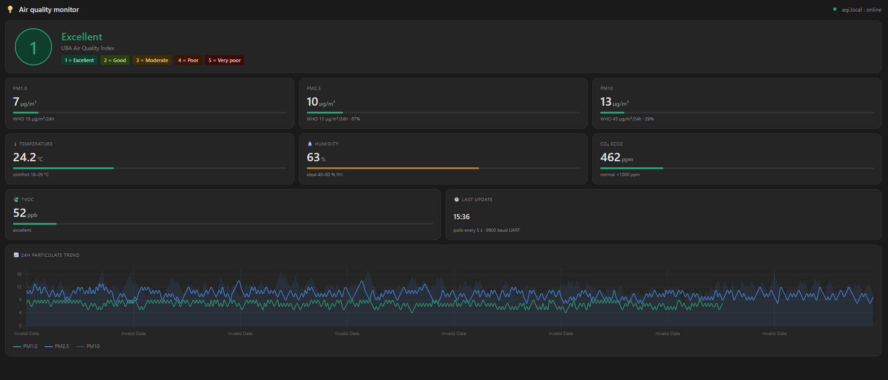

# APC1001U Air Quality Monitor for Home Assistant

Full air quality monitoring using the **ScioSense APC1001U** sensor and an **ESP32**, integrated into Home Assistant via ESPHome.

**Measures:** PM1.0 · PM2.5 · PM10 · TVOC · eCO2 · Temperature · Humidity · AQI (UBA 1–5)



---

## Hardware required

| Item | Notes |
|------|-------|
| ScioSense APC1001U | UART variant (`1001U` suffix) |
| ESP32 dev board | Any standard 38-pin board |
| JST-GH 1.25mm 8-pin cable | Matches APC1 connector |
| 5V power supply | APC1 draws up to 120 mA peak |

---

## Wiring

```
APC1001U pin 1  (VDD)     →  5V rail        ← MUST be 5V, not 3.3V
APC1001U pin 2  (GND)     →  GND
APC1001U pin 4  (UART_RX) →  ESP32 GPIO17
APC1001U pin 5  (UART_TX) →  ESP32 GPIO16
Pins 3, 6, 7, 8           →  leave unconnected
```

> **Important:** The APC1001U requires a true 5V supply. Powering from 3.3V will produce no readings.

---

## Installation

### Step 1 — Flash the ESP32

1. Copy `aqi-sensor.yaml` from this repo
2. Fill in your WiFi credentials (the only edit required)
3. Flash via ESPHome — in Home Assistant ESPHome Builder, or from a Mac/PC:

```bash
pip install esphome
esphome run aqi-sensor.yaml
```

The `external_components` block pulls the sensor driver automatically from this GitHub repo — no manual file copying needed.

### Step 2 — Add to Home Assistant

Once flashed and powered, the device appears automatically in **Settings → Integrations → ESPHome**. Accept the discovered device.

### Step 3 — Install the custom dashboard

In your HA terminal (Terminal & SSH add-on), run:

```bash
mkdir -p /config/www
curl -o /config/www/aqi_dashboard.html \
  https://raw.githubusercontent.com/YOUR_USERNAME/apc1001u-ha/main/aqi_dashboard.html
ha core restart
```

Then go to **Settings → Dashboards → Add Dashboard**, enter the URL:
```
/local/aqi_dashboard.html
```

Open the dashboard, create a Long-Lived Access Token from your HA profile, paste it in, and click Connect.

---

## Sensor warm-up

| Sensor | Warm-up time |
|--------|-------------|
| PM1.0 / PM2.5 / PM10 | ~30 seconds (fan spin-up) |
| TVOC / eCO2 / AQI | ~3 minutes (MOX sensor) |
| TVOC first ever power-on | ~60 minutes (initial conditioning) |

TVOC and eCO2 will show "Warming up" until ready — this is normal.

---

## AQI scale

The AQI uses the **UBA (German Federal Environment Agency)** scale:

| Value | Label | Meaning |
|-------|-------|---------|
| 1 | Excellent | Clean air |
| 2 | Good | Minor pollution |
| 3 | Moderate | Sensitive groups may be affected |
| 4 | Poor | Health effects possible |
| 5 | Very poor | Serious health effects |

---

## Changing GPIO pins

Edit `aqi-sensor.yaml`:
```yaml
uart:
  rx_pin: GPIO16   # ← APC1 pin 5 (UART_TX)
  tx_pin: GPIO17   # ← APC1 pin 4 (UART_RX)
```

---

## License

MIT — free to use, modify, and distribute.
